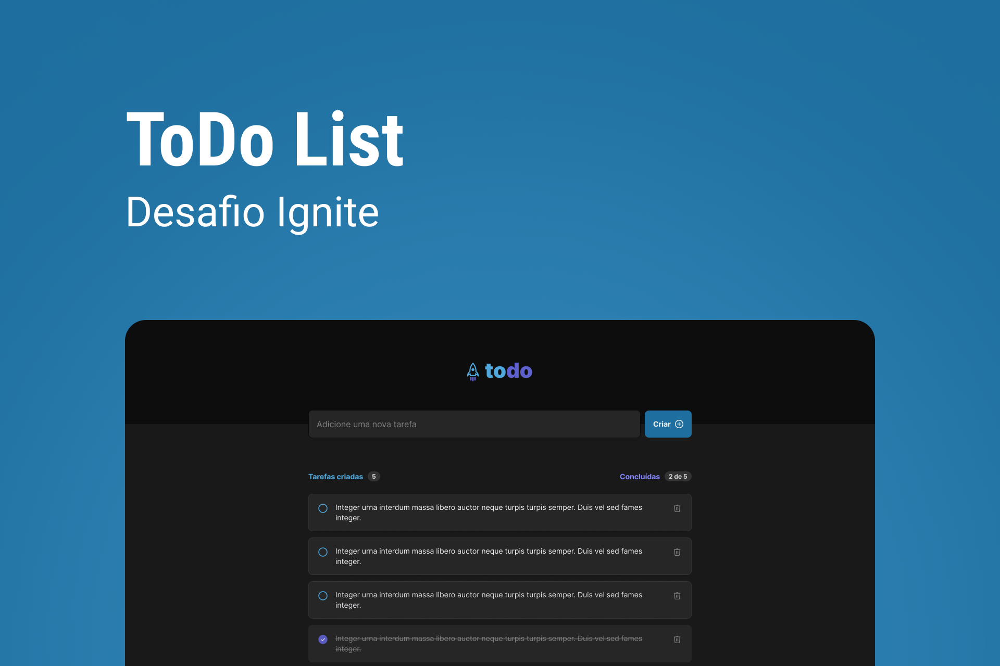

<p align="center">
  
</p>

<h1 align="center">ToDo - Task Manager </h1>

<p align="center">
  A Task Manager Webapp
</p>

<p align="center">
  <a href="#-technologies">Technologies</a>&nbsp;&nbsp;|&nbsp;&nbsp;
  <a href="#-packages">Packages</a>&nbsp;&nbsp;|&nbsp;&nbsp;
  <a href="#-getting-started">Getting started</a>&nbsp;&nbsp;|&nbsp;&nbsp;
  <a href="#author">Author</a>
</p>

<p align="center">
  
  
</p>

<br>

<p align="center">
  
</p>

## 🚀 Technologies

Here are the technologies used in this project.

- TypeScript 4.9.3
- ReactJS 18.2.0
- Vite 4.1.0

---

## 📦 Packages

Here are the packages used in this project.

- phosphor-react -> Library with various icon providers for react.
- radix-ui -> Unstyled, accessible components for building design systems and web apps in React.
- uuid -> Creates RFC4122 UUIDs

---

## 💻 Getting started

Here are the commands and steps on how to start the project.

**Dependency**

- NodeJS
- NPM (Package manager of your choice)

---

Install the dependencies using a package manager, the one used in the project was NPM.

```
npm install
```

To start the project on your machine using NPM.

```
npm run dev
```

To build the project using NPM.

```
npm run build
```

To run the project in production using NPM.

```
npm run start
```

---

## Author

Made with ♥ by Daniel Gonçalves 🚀 [dsg1407](https://github.com/dsg1407)
